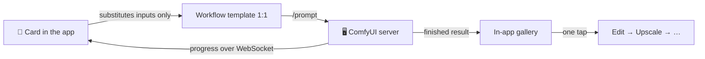

<div align="center">

*[Česky](README.md) · **English***

# 🎬 PocketComfy

### A whole AI studio in your pocket — running on your own PC

**Video · Images · Old photo restoration · Face swap · Inpainting · Music with vocals**

A native Android client for your own ComfyUI server. No cloud, no subscription,
no data leaving your home — the phone is just a remote control for the machine
with the GPU.


<br>

&nbsp;
&nbsp;
&nbsp;


</div>

> **Language:** the app speaks English and Czech. It follows your phone's
> language by default; you can force either one in Settings. A few advanced
> strings are still Czech-only and fall back gracefully — no blank labels.

---

## ⚠️ What you need before you start

PocketComfy is a **client** — it generates nothing on its own:

| | Requirement | Details |
|---|---|---|
| 🖥️ | **PC with an NVIDIA GPU** (16 GB VRAM recommended) running **[ComfyUI](https://github.com/comfyanonymous/ComfyUI)** | started with `--listen 0.0.0.0` |
| 🧩 | **Custom nodes and models** | full list: **[REQUIREMENTS.en.md](REQUIREMENTS.en.md)** · on Windows the script **[instalace-serveru.bat](instalace-serveru.bat)** installs them · whatever is missing, the app tells you |
| 📱 | **An Android phone** (Android 8+) | on the same Wi-Fi as the PC |
| 🌍 | **[Tailscale](https://tailscale.com)** (optional) | free VPN that makes the app work away from home — [see INSTALL.en.md](INSTALL.en.md#access-from-anywhere-optional-recommended) |

📖 **Full walkthrough from zero to your first video: [INSTALL.en.md](INSTALL.en.md)**

## ✨ Why you may like it

- 🏠 **100 % local.** Your PC does the work; the app only submits jobs and downloads results. Over a VPN (Tailscale) it works from anywhere in the world.
- 🧠 **Workflows stay untouched.** The app does not invent its own graphs — every card runs a finished, tuned workflow **verbatim** and only substitutes your inputs. Unit tests assert that nothing else in the graph changes.
- 🔍 **"What's missing on the server" in one tap.** The app compares its workflows against your ComfyUI and tells you **which node pack to install and which model to drop into which folder — with download links**. The list can be copied to your PC. Workflows are bundled inside the app, so there is nothing to hunt down by hand.
- 🔗 **One-tap chaining.** Generate an image → "Edit" → describe the change → "Upscale" → gigapixel. No downloading and re-uploading.
- 📴 **A network drop never kills a job.** The phone can go to sleep, the PC keeps computing — the app re-attaches to the run, even after a restart.
- 🎮 **GPU on demand.** A button in Settings starts and stops ComfyUI remotely, so you can free the GPU for games.
- 🖌️ **Paint the mask with your finger.** For face swap you scribble over the face right in the app — pinch to zoom for detail, brush size, undo, eraser.
- ✨ **Let AI write the prompt.** Type a few words and a language model expands them into a full prompt — shots, timing and soundscape for video, a Z-Image style description for stills. It runs as a workflow inside your own ComfyUI (one extra model required, [see REQUIREMENTS](REQUIREMENTS.en.md)), so nothing leaves the house.
- 📋 **Job queue.** While one run is going, prepare the next and add it to the queue — runs start automatically one after another, each finished one arrives as a notification.
- 🗂️ **Gallery with filter and search.** Videos / images / music separately, search in prompts, undo delete. Each result shows how long it took.

## 🃏 Ten cards

| | Card | Model | What it does |
|---|---|---|---|
| 🎬 | **All in One** | MiniMax H3 | video from text, image, references or keyframes; extension; upscale |
| 🗣️ | **Dialogue** | MiniMax H3 + Higgs Audio | characters from photos speak your lines |
| 🎞️ | **Timeline** | MiniMax H3 + LSI | long video assembled from segments |
| 🖼️ | **Image** | Z-Image Turbo | a new picture from text in seconds |
| ✏️ | **Image edit** | Krea 2 + Identity Edit | "give her a red jacket" — the face stays |
| 🩹 | **Photo restore** | Qwen Image Edit 2511 | an old or damaged photo as new, including colorization |
| 🎭 | **Face swap** | Flux Fill + ACE++ | scribble over the face, pick a new one, done |
| 🖌️ | **Inpaint** | FLUX.2 Klein / Flux Fill | scribble over a spot, type what belongs there, only that changes |
| 🔎 | **Upscale** | SeedVR2 | gigapixel upscale in tiles (2×2 up to 4×4) |
| 🎵 | **Music** | ACE-Step 1.5 | a whole song from text — style, verses, chorus, vocals |

<div align="center">
&nbsp;
&nbsp;

</div>

## 🚀 Quick start

> 📖 **Step-by-step guide: [INSTALL.en.md](INSTALL.en.md)** — server, nodes,
> models, building the app, Tailscale and troubleshooting.

1. **Server:** a PC with ComfyUI and an NVIDIA GPU (developed on an RTX 4060 Ti
   16 GB), started with `--listen 0.0.0.0`. Custom nodes and models per
   [REQUIREMENTS.en.md](REQUIREMENTS.en.md) — whatever is missing, the app lists
   for you under **Settings → Check server**.
2. **Build the app** — either open the project in
   [Android Studio](https://developer.android.com/studio) and hit Run, or from
   a terminal:

   ```bash
   git clone https://github.com/Promptlab37/PocketComfy.git
   cd PocketComfy
   ./gradlew assembleDebug
   # result: app/build/outputs/apk/debug/app-debug.apk
   ```

   Building from source means what runs on your phone is exactly what you see
   in this repository. To update: `git pull` and build again.
3. **First launch:** the app asks for the server address, tests the connection
   and shows whether anything is missing. Then just create.

## 🧭 How it works inside



- `comfy/*Builder.kt` — value substitution into templates (tests assert nothing else changes)
- `engine/GenerationEngine.kt` — upload → queue → watch → download; a network drop never kills a run
- `comfy/ServerAudit.kt` — templates compared against `/object_info` ("what's missing on the server")
- `engine/RunTexts.kt` — progress wording, one matrix for all ten cards

Source comments are in Czech; identifiers and structure are self-explanatory,
and this document plus [INSTALL.en.md](INSTALL.en.md) cover everything you need
to run and modify the app.

## ⚖️ License and disclaimers

- App code: [MIT](LICENSE).
- **The app contains and distributes no models, weights or third-party code.**
  It is purely a client: it sends HTTP requests to ComfyUI (and optionally to
  Higgs Audio Studio) that you install and operate yourself. Model licenses
  apply to you as their operator.
- **Check the model licenses yourself.** In particular: the **MiniMax H3**
  community license excludes use in the EU (including outputs); **Krea 2**
  requires content filtering and applies below 1M USD annual revenue; SeedVR2
  is Apache-2.0; **Higgs Audio** has its own license with mandatory attribution.
- The workflow templates are functional graphs (node wiring and parameters)
  derived from official ComfyUI templates and community workflows; face swap
  builds on the ACE++ inpaint workflow by
  [Sebastian Kamph](https://www.patreon.com/sebastiankamph). Thanks to all authors.
- The LSI Timeline pack and the Krea2Edit/H3 helper nodes **are not publicly
  available** — the Timeline and Image edit cards need them; the other seven
  cards work without them.

---

<div align="center">

**Like it? Leave a ⭐ — it helps the app reach other people running their own ComfyUI.**

</div>
