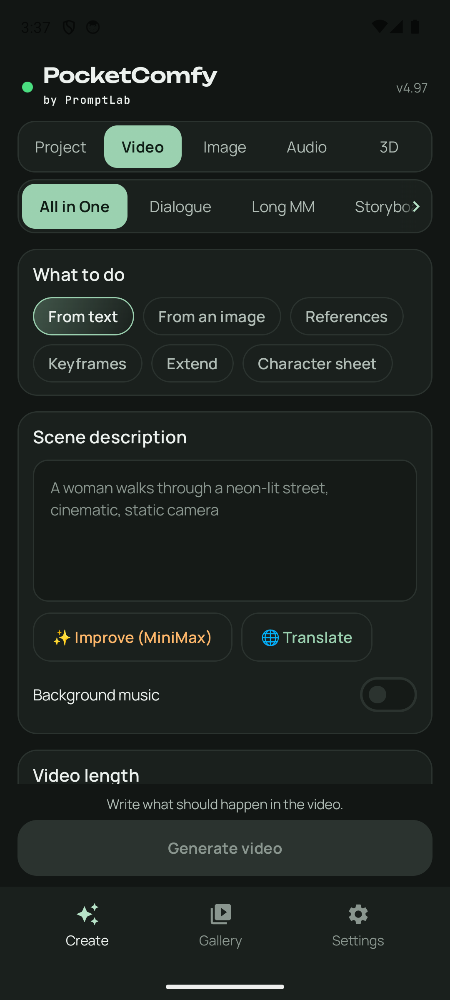
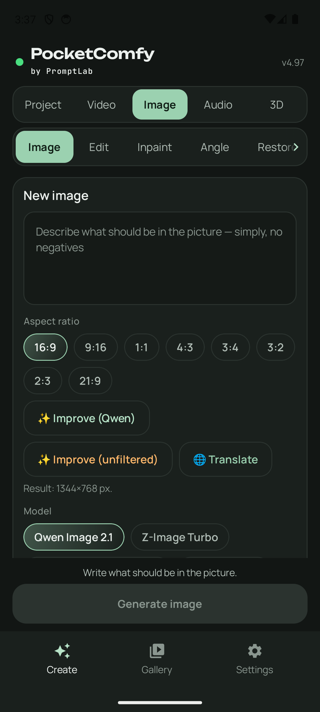
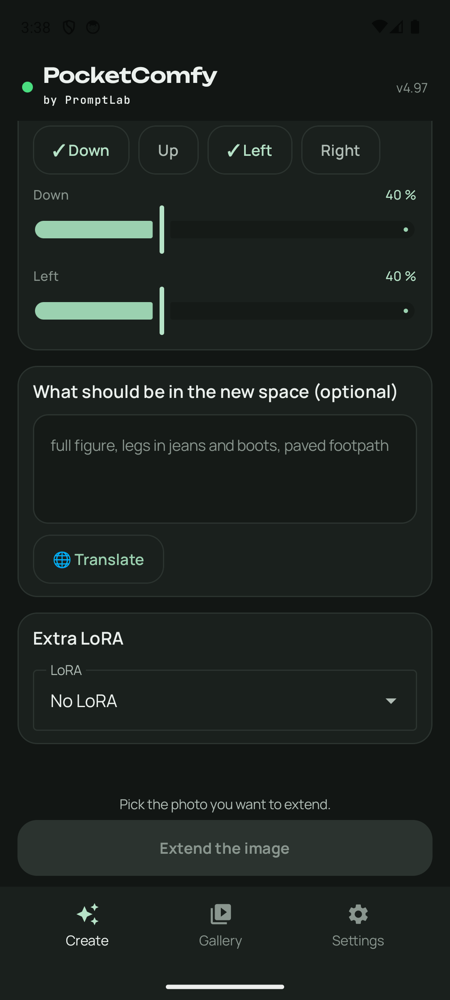
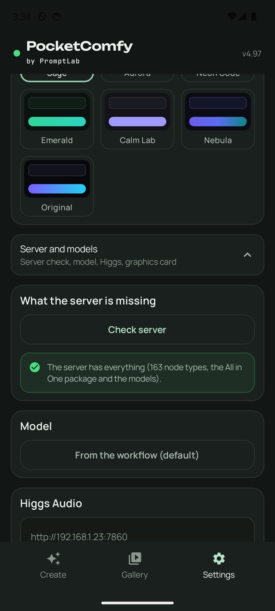
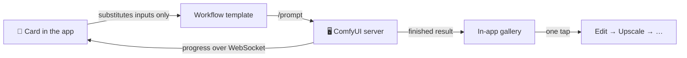

<div align="center">

*[Česky](README.md) · **English***

# 🎬 PocketComfy

### A whole AI studio in your pocket, running on your own PC

**Video · Images · Inpaint & outpaint · Face swap · Upscale · Music · 3D**

A native Android client for your own ComfyUI server. No cloud, no subscription,
no data leaving your home: the phone is a remote control for the machine with
the GPU.


<br>

&nbsp;
&nbsp;
&nbsp;


</div>

> **Language:** the app speaks English and Czech. It follows your phone's
> language (any language other than Czech gets English); you can force either
> one in **Settings → App → Language**.

---

## Download

**[Latest signed APK](https://github.com/Promptlab37/PocketComfy/releases/latest)**.
Updates are offered right in the app (Settings), no GitHub account needed.
Or build it yourself from this repository, see [Quick start](#-quick-start).

## ⚠️ What you need before you start

PocketComfy is a **client**; it generates nothing on its own:

| | Requirement | Details |
|---|---|---|
| 🖥️ | **PC with an NVIDIA GPU** (developed on 16 GB VRAM) running **[ComfyUI](https://github.com/comfyanonymous/ComfyUI)** | started with `--listen 0.0.0.0` |
| 🧩 | **Custom nodes and models** for the cards you want to use | full list: **[REQUIREMENTS.en.md](REQUIREMENTS.en.md)** · on Windows **[instalace-serveru.bat](instalace-serveru.bat)** installs the node packs and offers the models card by card · whatever is missing, the app tells you |
| 📱 | **An Android phone** (Android 8+) | on the same network as the PC |
| 🌍 | **[Tailscale](https://tailscale.com)** (optional) | free VPN, so the app works away from home, [see INSTALL.en.md](INSTALL.en.md#access-from-anywhere-optional-recommended) |

📖 **Full walkthrough from zero to your first video: [INSTALL.en.md](INSTALL.en.md)**

## ✨ Why you may like it

- 🏠 **100 % local.** Your PC does the work; the app only submits jobs and downloads results.
- 🧠 **Real workflows, not improvisations.** Every card runs a finished workflow template and only substitutes your inputs (photo, prompt, seed, size…). Unit tests guard that nothing else in the graph changes.
- 🔍 **"What's missing on the server" in one tap.** The app compares its workflows with your ComfyUI (`/object_info`) and lists **which node pack to install and which model goes into which folder, with download links**.
- 🔗 **One-tap chaining.** Image → Edit → Inpaint / Extend → Upscale, without downloading and re-uploading.
- 📴 **A network drop never kills a job.** The phone can sleep, the PC keeps computing, the app re-attaches to the run.
- 📋 **Job queue.** Prepare the next job while one is running; runs start one after another.
- ✨ **Prompt enhancer and translator.** A local language model inside your ComfyUI expands a few words into a full prompt, or translates your own language into English.
- 🖌️ **Paint masks with your finger.** Pinch to zoom, brush size, undo, eraser.
- 🗂️ **Gallery** with filters, search, favorites and batch delete.
- 🎨 **Seven looks** to choose from in Settings.

## 🃏 The cards

Cards are grouped into **Video · Image · Audio · 3D**, plus a **Project** board
for planning a film shot by shot. Any card you don't use can be hidden in Settings.

**Video**

| Card | Models | What it does |
|---|---|---|
| **All in One** | MiniMax H3 | video from text, an image, references or keyframes; extend a video; character sheet |
| **Dialogue** | MiniMax H3 + Higgs Audio | characters from photos speak your lines |
| **Long MiniMax** | MiniMax H3 | shot after shot of one scene, each continuing from the saved latent of the previous one |
| **Film from storyboard** *(experimental)* | MiniMax H3 | reads a storyboard grid (panels, timing, dialogue), shows the per-shot prompts for editing, then renders one continuous film; or plans shots from a short story |
| **Timeline** | MiniMax H3 + LSI nodes | longer video assembled from segments |
| **Quick video** | MiniMax H3 + 3-step LoRA | three steps at low resolution, latent upscale, two refining steps |
| **LTX 2.5** | LTX 2.5 | video with native sound from text or an image, or a photo speaking a recorded audio track |
| **Character motion** | Wan-Dancer / Wan-Animate 2 | a character from a photo dances to music, or repeats the motion from a video |
| **Edit video** | MiniMax H3 · SCAIL-2 · Wan 2.2 (Bernini-R) | repaint an object, replace a character, follow a pose/edge video, or edit by instruction |
| **Enhance video** | SeedVR2 / RTX Video SR · FILM | upscale a video, or make it smoother (2×–4× frame interpolation) |

**Image**

| Card | Models | What it does |
|---|---|---|
| **Image** | Qwen Image 2.1, Z-Image Turbo, Z-Image Base, FLUX.2 Klein 9B, ERNIE Image Turbo, Photoreal | a new picture from text |
| **Image edit** | Krea 2 + Identity Edit LoRA, Qwen Image 2.1, FLUX.2 Klein 9B | "give her a red jacket", the face stays |
| **Inpaint** | Flux Fill, FLUX.2 Klein, Qwen Image 2.1 | repaint only the spot you scribbled over; or **extend the image** in any direction with its own slider per side (Qwen Image 2.1 + outpaint LoRA) |
| **Camera angle** | Qwen Image Edit 2511 + Multiple Angles LoRA | the same subject from another spot: 8 directions × 4 heights × 3 distances, no typing |
| **Photo restore** | Qwen Image 2.1 | an old or damaged photo as new, including colorization |
| **Face swap** | Qwen Image 2.1 + BFS, or Flux Fill + ACE++ | scribble over the face, pick a new one |
| **Upscale photo** | SeedVR2 · DLSS 5 · Smart Upscaler | gigapixel upscale in tiles, fast sharpening, or AI-guided tiled upscale |

**Audio and 3D**

| Card | Models | What it does |
|---|---|---|
| **Music** | ACE-Step 1.5, YuE2, MiniMax Music 3 | a whole song from text (style, lyrics, vocals), or remake a recording |
| **3D model** | TRELLIS.2 / Pixal3D | a textured mesh (`.glb`) from one photo, orbit it with your finger |

## 🚀 Quick start

> 📖 **Step-by-step guide: [INSTALL.en.md](INSTALL.en.md)**: server, nodes,
> models, building the app, Tailscale and troubleshooting.

1. **Server:** a PC with ComfyUI and an NVIDIA GPU, started with
   `--listen 0.0.0.0`. Custom nodes and models per
   [REQUIREMENTS.en.md](REQUIREMENTS.en.md); you only need what the cards you
   use require. The app lists whatever is missing under **Settings → Check server**.
2. **Install the app:** the signed APK from
   [Releases](https://github.com/Promptlab37/PocketComfy/releases/latest), or build it:

   ```bash
   git clone https://github.com/Promptlab37/PocketComfy.git
   cd PocketComfy
   ./gradlew assembleDebug
   # result: app/build/outputs/apk/debug/app-debug.apk
   ```

3. **First launch:** enter the server address (e.g. `http://192.168.1.23:8188`),
   test the connection, and create.

## 🧭 How it works inside


```mermaid
flowchart LR
    A[📱 Card in the app] -->|substitutes inputs only| B[Workflow template]
    B -->|/prompt| C[🖥️ ComfyUI server]
    C -->|progress over WebSocket| A
    C -->|finished result| D[In-app gallery]
    D -->|one tap| E[Edit → Upscale → …]
```

- `comfy/*Builder.kt`: value substitution into the templates in `res/raw` (tests assert nothing else changes)
- `engine/GenerationEngine.kt`: upload → queue → watch → download; a network drop never kills a run
- `comfy/ServerAudit.kt` + `comfy/Katalog.kt`: templates compared with `/object_info` ("what's missing on the server")

Source comments are in Czech; identifiers and structure are self-explanatory,
and this document plus [INSTALL.en.md](INSTALL.en.md) cover what you need to
run and modify the app.

## ⚖️ License and disclaimers

- App code: [MIT](LICENSE).
- **The app contains and distributes no models, weights or third-party code.**
  It is purely a client: it sends HTTP requests to ComfyUI (and optionally to
  Higgs Audio) that you install and operate yourself. Model licenses apply to
  you as their operator.
- **Check the model licenses yourself.** In particular: the **MiniMax H3**
  community license excludes use in the EU (including outputs); **Krea 2**
  requires content filtering and applies below 1M USD annual revenue;
  **Qwen Image 2.1** is under the Qwen Research License
  ([LICENSE-Qwen-Research.txt](LICENSE-Qwen-Research.txt)); SeedVR2 is
  Apache-2.0; **Higgs Audio** has its own license with mandatory attribution.
- **By using this app with MiniMax H3 you agree to comply with** the
  [MiniMax H3 Community License Agreement](https://huggingface.co/MiniMaxAI/MiniMax-H3/blob/main/LICENSE)
  and its Acceptable Use Policy (Exhibit A), see [NOTICE](NOTICE). Specifically:
  in the EU, the UK, the Republic of Korea and the USA you need your own
  authorization from MiniMax; a commercial product must prominently display
  "MiniMax H3" in its user interface; published content must be clearly
  disclosed as machine-generated; and if you pass the tool on, you must bind
  the recipient to the same terms. **Report suspected violations through this
  repository's Issues.**
- The workflow templates are functional graphs (node wiring and parameters)
  derived from official ComfyUI templates and community workflows, e.g. the
  outpaint setup follows [ausboss/Qwen-Image-2.1-Outpaint-LoRA](https://huggingface.co/ausboss/Qwen-Image-2.1-Outpaint-LoRA)
  and face swap builds on the ACE++ inpaint workflow by
  [Sebastian Kamph](https://www.patreon.com/sebastiankamph). Thanks to all authors.
- The **LSI Timeline** node pack is **not publicly available**; only the
  Timeline card needs it.

---

<div align="center">

**Like it? Leave a ⭐ — it helps the app reach other people running their own ComfyUI.**

</div>
