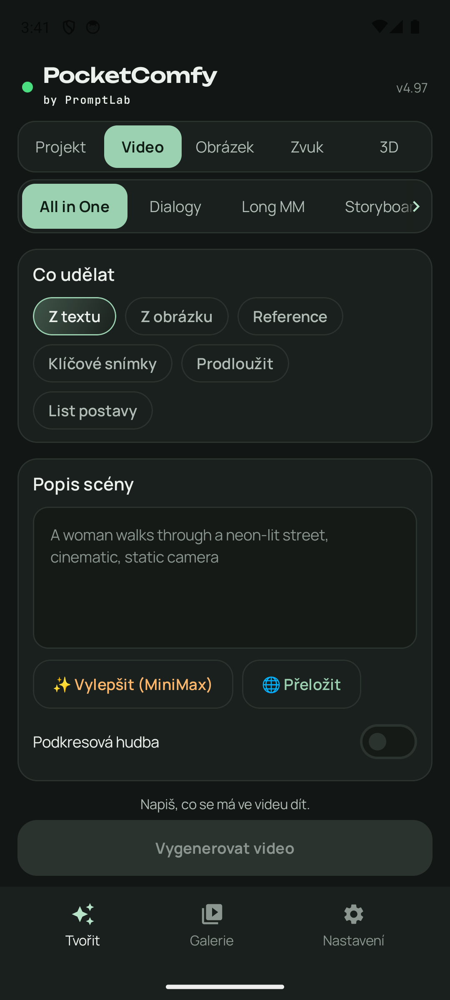
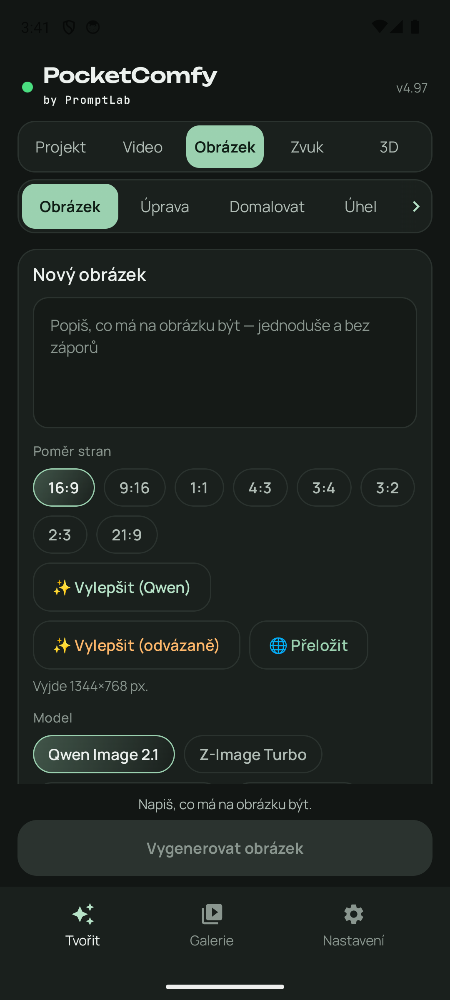
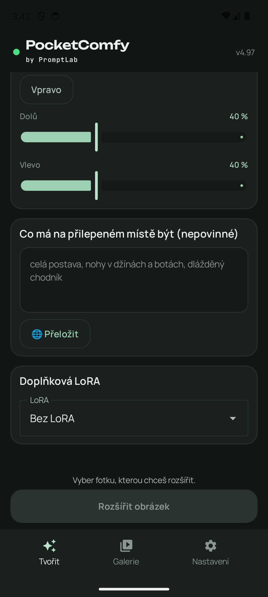
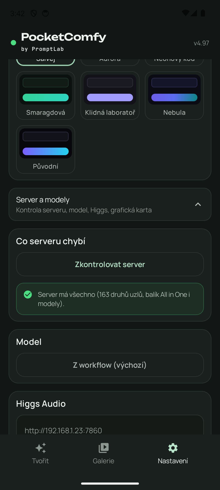

*[Česky](README.md) · **English***

# 🎬 PocketComfy by PromptLab

### A whole AI studio in your pocket, powered by your own computer

**Video · Images · Editing · Upscaling · Music · Voice · 3D**

An Android app that drives your own ComfyUI server from your phone.
No cloud, no subscription: the phone is a remote control for a computer with a graphics card.

 

&nbsp;
&nbsp;
&nbsp;

---

## 🔒 Development continues in a closed version

PocketComfy is still being developed, but new features and improvements now live in a **private version**.
This repository stays as a showcase and an archive of the last public release.

**Interested in collaboration, video production or access to the current version?**
Write to **[info@promptlab.cz](mailto:info@promptlab.cz)** · **[promptlab.cz](https://promptlab.cz)**

---

## 📥 Last public release

**[PocketComfy 5.71 – download the APK](https://github.com/Promptlab37/PocketComfy/releases/tag/v382)**

5.71 is the last version released publicly; further updates will not be published here.

## What the app does

- **Video**: from an image or from text, long video from chained parts, talking scene with voice
- **Images**: text to image, editing, outpainting, face swap, old photo restoration
- **Upscaling** of images and videos
- **Music** and **voice**
- **3D model** from a photo

The app needs your own computer running a ComfyUI server with a powerful graphics card.

---

PromptLab · [promptlab.cz](https://promptlab.cz) · Code of versions up to 5.71 is MIT-licensed (see LICENSE).
