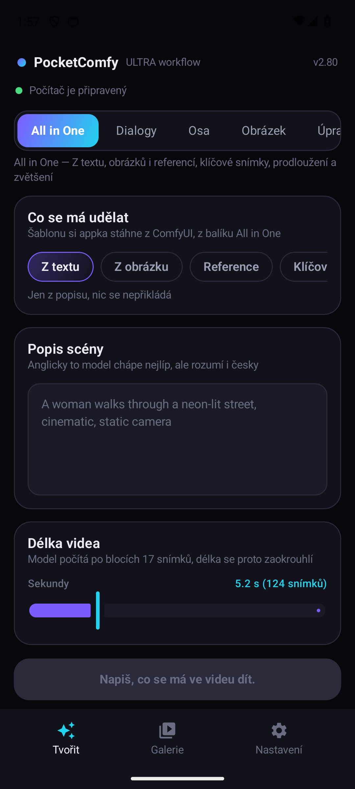
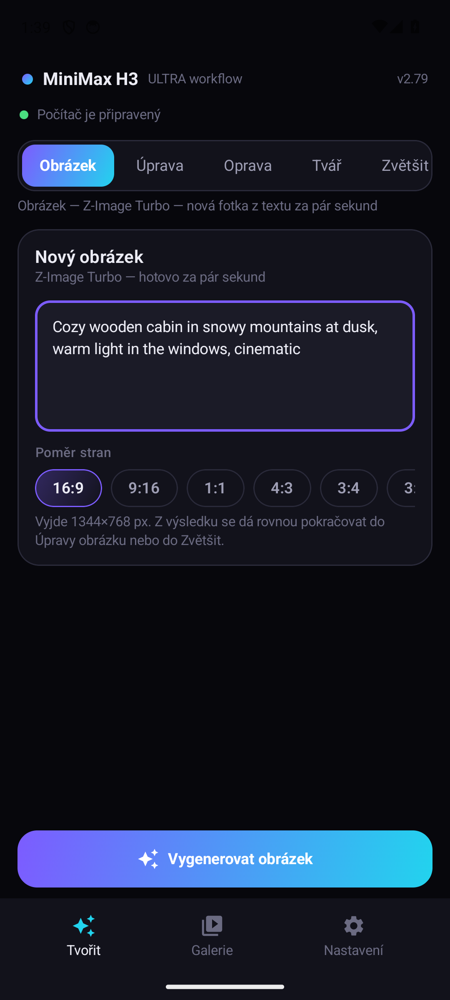
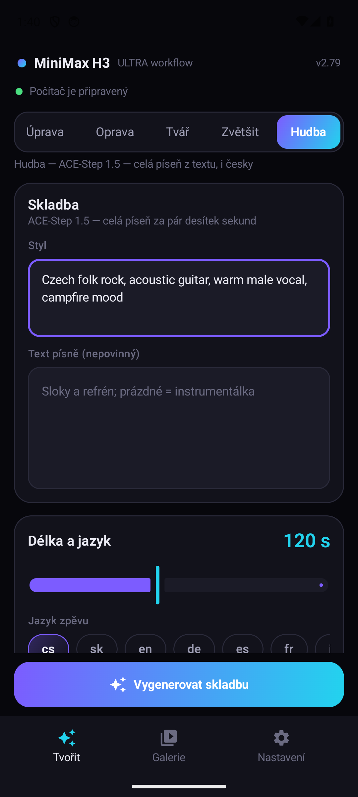
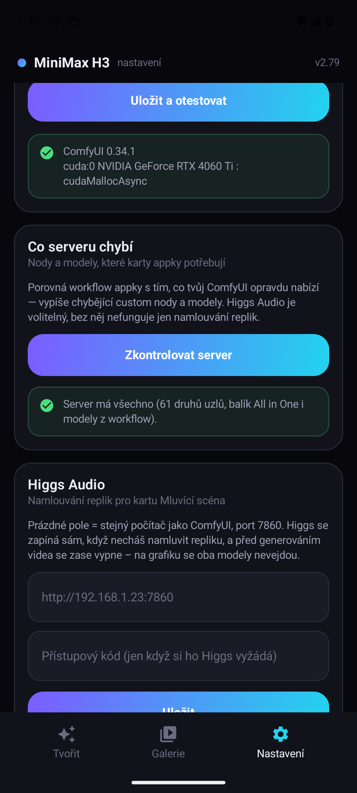
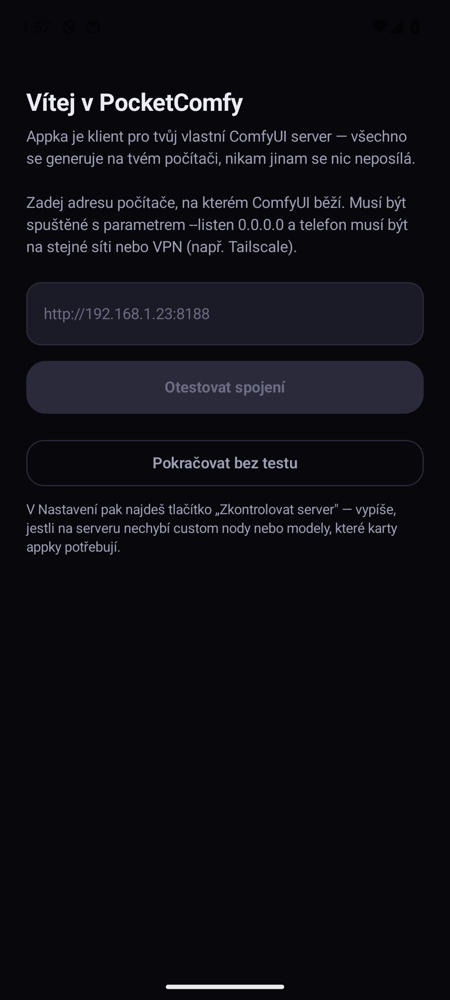
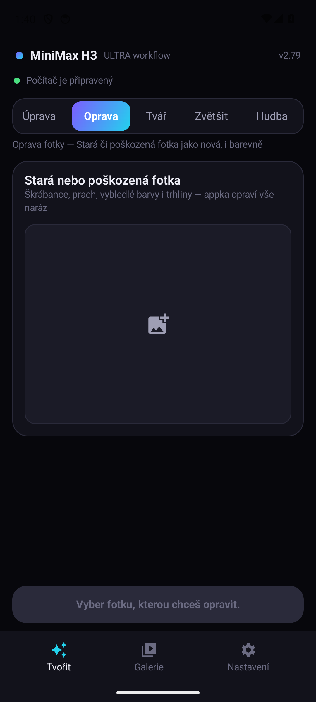
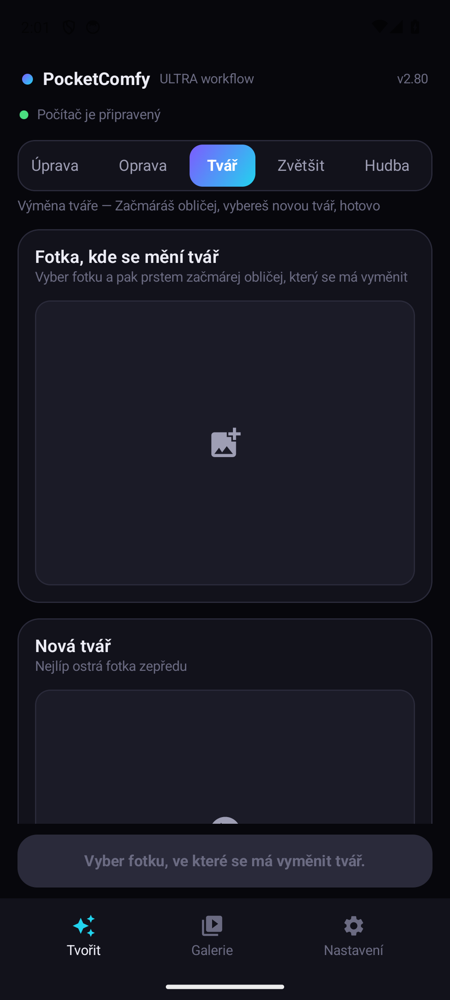
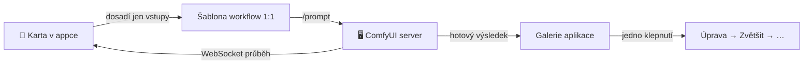

<div align="center">

# 🎬 H3 Video

### Celé AI studio z kapsy — na tvém vlastním počítači

**Video · Obrázky · Oprava starých fotek · Výměna tváře · Hudba s českým zpěvem**

Nativní Android klient pro tvůj ComfyUI server. Žádný cloud, žádné předplatné,
žádná data mimo tvůj dům — telefon je jen dálkový ovladač počítače s grafikou.


<br>

&nbsp;
&nbsp;
&nbsp;


</div>

---

## ✨ Proč si ji zamiluješ

- 🏠 **100 % lokální.** Generuje tvůj počítač, appka jen posílá zadání a stahuje výsledky. Přes VPN (Tailscale) to funguje odkudkoli na světě.
- 🧠 **Nerozbitné workflow.** Appka si nevymýšlí vlastní grafy — každá karta jede na hotovém, vyladěném workflow **1:1** a dosazuje jen tvoje vstupy. Testy hlídají, že se v grafu nezmění nic jiného.
- 🔍 **„Co serveru chybí" jedním klepnutím.** Appka porovná svá workflow s tvým ComfyUI a vypíše jmenovitě chybějící custom nody a modely. Žádné hádání, proč to nejede.
- 🔗 **Řetěz na jedno klepnutí.** Vygeneruješ obrázek → „Upravit" → popíšeš změnu → „Zvětšit" → gigapixel. Bez stahování a přeposílání.
- 📴 **Výpadek sítě nikdy nezabije úlohu.** Telefon může zhasnout, počítač počítá dál — appka se k běhu zase přilepí, klidně i po restartu.
- 🎮 **Grafika na povel.** Tlačítkem v Nastavení ComfyUI na dálku vypneš (a jde se hrát) i zapneš.
- 🖌️ **Maska prstem.** U výměny tváře začmáráš obličej přímo v appce — s velikostí štětce, krokem zpět a gumou.

## 🃏 Devět karet

| | Karta | Model | Co umí |
|---|---|---|---|
| 🎬 | **All in One** | MiniMax H3 | video z textu, obrázku, referencí, klíčových snímků; prodloužení; upscale |
| 🗣️ | **Dialogy** | MiniMax H3 + Higgs Audio | postavy z fotek řeknou tvoje repliky (i česky) |
| 🎞️ | **Časová osa** | MiniMax H3 + LSI | dlouhé video poskládané ze segmentů |
| 🖼️ | **Obrázek** | Z-Image Turbo | nová fotka z textu za pár sekund |
| ✏️ | **Úprava obrázku** | Krea 2 + Identity Edit | „dej jí červenou bundu" — tvář zůstane |
| 🩹 | **Oprava fotky** | Qwen Image Edit 2511 | stará/poškozená fotka jako nová, i barevně |
| 🎭 | **Výměna tváře** | Flux Fill + ACE++ | začmáráš obličej, vybereš novou tvář, hotovo |
| 🔎 | **Zvětšit** | SeedVR2 | gigapixel upscale po dlaždicích (2×2 až 4×4) |
| 🎵 | **Hudba** | ACE-Step 1.5 | celá píseň z textu — styl, sloky, refrén, i český zpěv |

<div align="center">
&nbsp;
&nbsp;

</div>

## 🚀 Rychlý start

1. **Server:** počítač s ComfyUI a NVIDIA grafikou (vyvíjeno na RTX 4060 Ti 16 GB),
   spuštěné s `--listen 0.0.0.0`. Custom nody a modely podle [POZADAVKY.md](POZADAVKY.md) —
   co chybí, ti appka sama vypíše v **Nastavení → Zkontrolovat server**.
2. **Sestav APK** (hotové se tu nevydává — kód je celý tady):

   ```bash
   git clone https://github.com/Promptlab37/H3VideoApp.git
   cd H3VideoApp
   ./gradlew assembleDebug
   # výsledek: app/build/outputs/apk/debug/app-debug.apk
   ```

   Stačí JDK 17 + Android SDK (nejjednodušeji [Android Studio](https://developer.android.com/studio):
   otevřít složku, stisknout Run). Debug build se podepíše sám, žádný klíč nepotřebuješ.
   Nová verze = `git pull` a přeložit znovu.
3. **První spuštění:** appka se zeptá na adresu serveru, otestuje spojení
   a ukáže, jestli něco nechybí. Pak už jen tvoř.

## 🧭 Jak to uvnitř funguje



- `comfy/*Builder.kt` — dosazování hodnot do šablon (testy hlídají, že se nemění nic jiného)
- `engine/GenerationEngine.kt` — upload → fronta → sledování → stažení; výpadek sítě běh nikdy neshodí
- `comfy/ServerAudit.kt` — porovnání šablon s `/object_info` („co serveru chybí")
- `engine/RunTexts.kt` — texty průběhu, jedna matice pro všech 9 karet

## ⚖️ Licence a upozornění

- Kód aplikace: [MIT](LICENSE).
- **Aplikace neobsahuje ani nedistribuuje žádné modely, váhy ani kód třetích
  stran.** Je to čistě klient: posílá HTTP požadavky na ComfyUI (a volitelně
  Higgs Audio Studio), které si instaluješ a provozuješ sám. Licence modelů
  se vztahují na tebe jako jejich provozovatele.
- **Licence modelů si ohlídej sám.** Zejména: komunitní licence **MiniMax H3**
  vylučuje užití v EU (včetně výstupů); **Krea 2** vyžaduje content filtering
  a platí do 1M USD ročních příjmů; SeedVR2 je Apache-2.0; **Higgs Audio** má
  vlastní licenci s povinnou atribucí.
- Workflow šablony jsou funkční grafy (zapojení uzlů a parametry) vycházející
  z oficiálních šablon ComfyUI a komunitních workflow; výměna tváře staví na
  ACE++ inpaint workflow od [Sebastiana Kamphe](https://www.patreon.com/sebastiankamph).
  Díky všem autorům.
- Balíky LSI Timeline a Krea2Edit/H3 pomocné uzly **nejsou veřejně dostupné** —
  karty Časová osa a Úprava obrázku pojedou jen s nimi; zbylých sedm karet
  funguje bez nich.

---

<div align="center">

**Líbí se ti to? Nech ⭐ — ať se appka dostane k dalším lidem s vlastním ComfyUI.**

</div>
