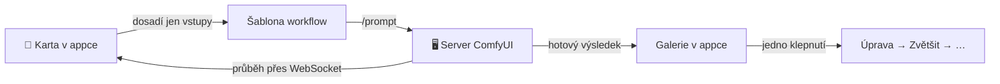

<div align="center">

***Česky** · [English](README.en.md)*

# 🎬 PocketComfy

### Celé AI studio v kapse, poháněné tvým vlastním počítačem

**Video · Obrázky · Domalování a rozšíření · Výměna tváře · Zvětšení · Hudba · 3D**

Nativní androidí klient pro tvůj vlastní server ComfyUI. Žádný cloud, žádné
předplatné, žádná data neopouštějí domov: telefon je dálkové ovládání počítače
s grafickou kartou.


<br>

&nbsp;
&nbsp;
&nbsp;


</div>

> **Jazyk:** appka mluví česky a anglicky. Řídí se jazykem telefonu (na
> jakémkoli jiném než českém je anglicky); vynutit jde kterýkoli z nich
> v **Nastavení → Aplikace → Jazyk**.

---

## Stažení

**[Nejnovější podepsané APK](https://github.com/Promptlab37/PocketComfy/releases/latest)**.
Aktualizace nabízí přímo appka (v Nastavení), účet na GitHubu není potřeba.
Nebo si ji sestav sám z tohoto repozitáře, viz [Rychlý start](#-rychlý-start).

## ⚠️ Co potřebuješ, než začneš

PocketComfy je **klient**; sám nic negeneruje:

| | Požadavek | Podrobnosti |
|---|---|---|
| 🖥️ | **Počítač s grafikou NVIDIA** (vyvíjeno na 16 GB VRAM) s **[ComfyUI](https://github.com/comfyanonymous/ComfyUI)** | spuštěným s `--listen 0.0.0.0` |
| 🧩 | **Custom nody a modely** pro karty, které chceš používat | úplný seznam: **[POZADAVKY.md](POZADAVKY.md)** · na Windows nainstaluje balíky nodů **[instalace-serveru.bat](instalace-serveru.bat)** a modely nabídne po kartách · co chybí, ti řekne appka |
| 📱 | **Telefon s Androidem** (Android 8+) | ve stejné síti jako počítač |
| 🌍 | **[Tailscale](https://tailscale.com)** (volitelně) | VPN zdarma, aby appka fungovala i mimo domov, [viz INSTALACE.md](INSTALACE.md#přístup-odkudkoli-volitelné-doporučené) |

📖 **Kompletní návod od nuly po první video: [INSTALACE.md](INSTALACE.md)**

## ✨ Proč se ti může líbit

- 🏠 **100 % lokálně.** Práci dělá tvůj počítač; appka jen zadává úlohy a stahuje výsledky.
- 🧠 **Skutečná workflow, žádné improvizace.** Každá karta spouští hotovou šablonu workflow a dosazuje do ní jen tvoje vstupy (fotku, prompt, seed, rozměr…). Unit testy hlídají, že se nic dalšího v grafu nezmění.
- 🔍 **„Co serveru chybí" na jedno klepnutí.** Appka porovná svá workflow s tvým ComfyUI (`/object_info`) a vypíše, **jaký balík nodů doinstalovat a který model patří do které složky, i s odkazy ke stažení**.
- 🔗 **Řetězení na jedno klepnutí.** Obrázek → Úprava → Domalovat / Rozšířit → Zvětšit, bez stahování a nahrávání.
- 📴 **Výpadek sítě úlohu nezabije.** Telefon může usnout, počítač počítá dál a appka se k běhu znovu připojí.
- 📋 **Fronta úloh.** Další úlohu si připravíš, zatímco jedna běží; běhy startují jeden po druhém.
- ✨ **Vylepšovač a překladač promptů.** Místní jazykový model ve tvém ComfyUI rozepíše pár slov na plný prompt, nebo přeloží tvůj jazyk do angličtiny.
- 🖌️ **Masky maluješ prstem.** Zoom dvěma prsty, velikost štětce, zpět, guma.
- 🗂️ **Galerie** s filtry, hledáním, oblíbenými a hromadným mazáním.
- 🎨 **Sedm vzhledů** na výběr v Nastavení.

## 🃏 Karty

Karty jsou seskupené do **Video · Obrázek · Zvuk · 3D**, k tomu nástěnka **Projekt**
na plánování filmu záběr po záběru. Kartu, kterou nepoužíváš, můžeš v Nastavení skrýt.

**Video**

| Karta | Modely | Co dělá |
|---|---|---|
| **All in One** | MiniMax H3 | video z textu, obrázku, referencí nebo klíčových snímků; prodloužení videa; list postavy |
| **Dialogy** | MiniMax H3 + Higgs Audio | postavy z fotek řeknou tvoje repliky |
| **Long MiniMax** | MiniMax H3 | záběr po záběru jedné scény, každý navazuje na uložený latent předchozího |
| **Film ze storyboardu** *(experimentální)* | MiniMax H3 | přečte mřížku storyboardu (panely, časování, dialogy), ukáže prompty jednotlivých záběrů k úpravě a pak vyrenderuje jeden souvislý film; nebo záběry naplánuje z krátkého příběhu |
| **Časová osa** | MiniMax H3 + nody LSI | delší video složené ze segmentů |
| **Rychlé video** | MiniMax H3 + LoRA na 3 kroky | tři kroky v nízkém rozlišení, zvětšení v latentu, dva dotahovací kroky |
| **LTX 2.5** | LTX 2.5 | video s nativním zvukem z textu nebo obrázku, nebo fotka, která mluví na nahraný zvuk |
| **Pohyb postavy** | Wan-Dancer / Wan-Animate 2 | postava z fotky tančí do hudby, nebo zopakuje pohyb z videa |
| **Upravit video** | MiniMax H3 · SCAIL-2 · Wan 2.2 (Bernini-R) | přemaluje objekt, vymění postavu, řídí se videem s pózou/obrysy, nebo upraví video podle pokynu |
| **Vylepšit video** | SeedVR2 / RTX Video SR · FILM | zvětší video, nebo ho zplynulí (interpolace snímků 2×–4×) |

**Obrázek**

| Karta | Modely | Co dělá |
|---|---|---|
| **Obrázek** | Qwen Image 2.1, Z-Image Turbo, Z-Image Base, FLUX.2 Klein 9B, ERNIE Image Turbo, Photoreal | nový obrázek z textu |
| **Úprava obrázku** | Krea 2 + Identity Edit LoRA, Qwen Image 2.1, FLUX.2 Klein 9B | „dej jí červenou bundu", tvář zůstane |
| **Domalovat** | Flux Fill, FLUX.2 Klein, Qwen Image 2.1 | přemaluje jen místo, které začmáráš; nebo **rozšíří obrázek** libovolným směrem, s vlastním posuvníkem pro každou stranu (Qwen Image 2.1 + outpaint LoRA) |
| **Úhel kamery** | Qwen Image Edit 2511 + Multiple Angles LoRA | tentýž objekt z jiného místa: 8 směrů × 4 výšky × 3 vzdálenosti, bez psaní |
| **Oprava fotky** | Qwen Image 2.1 | stará nebo poškozená fotka jako nová, včetně kolorizace |
| **Výměna tváře** | Qwen Image 2.1 + BFS, nebo Flux Fill + ACE++ | začmáráš obličej, vybereš nový |
| **Zvětšit fotku** | SeedVR2 · DLSS 5 · Smart Upscaler | gigapixelové zvětšení po dlaždicích, rychlé doostření, nebo zvětšení po dlaždicích řízené AI |

**Zvuk a 3D**

| Karta | Modely | Co dělá |
|---|---|---|
| **Hudba** | ACE-Step 1.5, YuE2, MiniMax Music 3 | celá píseň z textu (styl, text, zpěv), nebo předělání nahrávky |
| **3D model** | TRELLIS.2 / Pixal3D | otexturovaná síť (`.glb`) z jedné fotky, otáčíš s ní prstem |

## 🚀 Rychlý start

> 📖 **Návod krok za krokem: [INSTALACE.md](INSTALACE.md)**: server, nody,
> modely, sestavení appky, Tailscale a řešení potíží.

1. **Server:** počítač s ComfyUI a grafikou NVIDIA, spuštěný s
   `--listen 0.0.0.0`. Custom nody a modely podle
   [POZADAVKY.md](POZADAVKY.md); stačí to, co potřebují karty, které
   používáš. Co chybí, vypíše appka v **Nastavení → Zkontrolovat server**.
2. **Instalace appky:** podepsané APK z
   [Releases](https://github.com/Promptlab37/PocketComfy/releases/latest), nebo si ji sestav:

   ```bash
   git clone https://github.com/Promptlab37/PocketComfy.git
   cd PocketComfy
   ./gradlew assembleDebug
   # výsledek: app/build/outputs/apk/debug/app-debug.apk
   ```

3. **První spuštění:** zadej adresu serveru (např. `http://192.168.1.23:8188`),
   otestuj spojení a tvoř.

## 🧭 Jak to funguje uvnitř


```mermaid
flowchart LR
    A[📱 Karta v appce] -->|dosadí jen vstupy| B[Šablona workflow]
    B -->|/prompt| C[🖥️ Server ComfyUI]
    C -->|průběh přes WebSocket| A
    C -->|hotový výsledek| D[Galerie v appce]
    D -->|jedno klepnutí| E[Úprava → Zvětšit → …]
```

- `comfy/*Builder.kt`: dosazení hodnot do šablon v `res/raw` (testy hlídají, že se nic jiného nezmění)
- `engine/GenerationEngine.kt`: nahrání → fronta → sledování → stažení; výpadek sítě běh nezabije
- `comfy/ServerAudit.kt` + `comfy/Katalog.kt`: porovnání šablon s `/object_info` („co serveru chybí")

Komentáře ve zdrojácích jsou česky; tenhle dokument a [INSTALACE.md](INSTALACE.md)
pokrývají, co potřebuješ ke zprovoznění a úpravám appky.

## ⚖️ Licence a upozornění

- Kód appky: [MIT](LICENSE).
- **Appka neobsahuje ani nešíří žádné modely, váhy ani kód třetích stran.**
  Je to čistě klient: posílá HTTP požadavky do ComfyUI (a volitelně do
  Higgs Audio), které si instaluješ a provozuješ sám. Licence modelů platí
  pro tebe jako jejich provozovatele.
- **Licence modelů si zkontroluj sám.** Hlavně: komunitní licence **MiniMax H3**
  vylučuje použití v EU (včetně výstupů); **Krea 2** vyžaduje filtrování obsahu
  a platí pod 1 mil. USD ročního obratu; **Qwen Image 2.1** je pod Qwen Research
  License ([LICENSE-Qwen-Research.txt](LICENSE-Qwen-Research.txt)); SeedVR2 je
  Apache-2.0; **Higgs Audio** má vlastní licenci s povinným uvedením autora.
- **Používáním appky s MiniMax H3 souhlasíš s dodržováním**
  [MiniMax H3 Community License Agreement](https://huggingface.co/MiniMaxAI/MiniMax-H3/blob/main/LICENSE)
  a jejích Zásad přijatelného užití (Exhibit A), viz [NOTICE](NOTICE). Konkrétně:
  v EU, Spojeném království, Korejské republice a USA potřebuješ vlastní
  povolení od MiniMaxu; komerční produkt musí v uživatelském rozhraní viditelně
  uvádět „MiniMax H3"; zveřejněný obsah musí být jasně označený jako strojově
  vytvořený; a když nástroj předáš dál, musíš příjemce zavázat ke stejným
  podmínkám. **Podezření na porušení hlas přes Issues tohoto repozitáře.**
- Šablony workflow jsou funkční grafy (zapojení nodů a parametry) odvozené
  z oficiálních šablon ComfyUI a komunitních workflow; např. rozšíření obrázku
  vychází z [ausboss/Qwen-Image-2.1-Outpaint-LoRA](https://huggingface.co/ausboss/Qwen-Image-2.1-Outpaint-LoRA)
  a výměna tváře stojí na inpaint workflow ACE++ od
  [Sebastiana Kampha](https://www.patreon.com/sebastiankamph). Díky všem autorům.
- Balík nodů **LSI Timeline** **není veřejně dostupný**; potřebuje ho jen
  karta Časová osa.

---

<div align="center">

**Líbí se ti? Nech ⭐ — pomůže to appce dostat se k dalším lidem, kteří provozují vlastní ComfyUI.**

</div>
